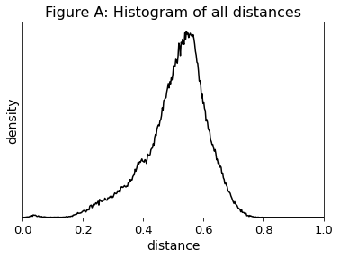
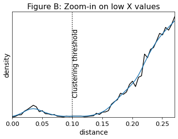

# Walkthough of Vamb from the Python interpreter

The Vamb pipeline consist of a series of tasks each which have a dedicated module:

1) Parse fasta file and get TNF of each sequence, as well as sequence length and names (module `parsecontigs`)

2) Parse the BAM files and get abundance estimate for each sequence in the fasta file (module `parsebam`)

3) Train a VAE with the abundance and TNF matrices, and encode it to a latent representation (module `encode`)

4) Cluster the encoded inputs to metagenomic bins (module `cluster`)

Additionally, for developing and testing Vamb, we use:

5) Benchmark the resulting bins against a gold standard (module `benchmark`)

In the following chapters of this walkthrough, we will go through each step in more detail from within the Python interpreter.
We will show how to use Vamb by example, what each step does, some of the theory behind the actions, and the different parameters that can be set.
With this knowledge, you should be able to extend or alter the behaviour of Vamb more easily.

Please know that the Python implementation of Vamb is considered internal.
This means that we may change, remove or rename any functions or classes in future releases of Vamb.
Therefore, this tutorial is intended to illustrate how Vamb works, broadly speaking.
If you want to extend Vamb or use its internal functions, be sure to fix the Vamb version so any changes to Vamb's internals won't break your code.

For the examples, we will assume the following relevant prerequisite files exists in the directory `/home/jakni/Downloads/vambdata/`:

* `filtered.fna.gz` - The filtered FASTA contigs which were mapped against, and
* `bam10k/*.bam` - 3 sample BAM files from reads to the contigs

## Table of contents:

### 1. [Introduction to metagenomic binning and best practices](#introduction)

### 2. [Importing Vamb and getting help](#importing)

### 3. [Calculate the sequence tetranucleotide frequencies](#parsecontigs)

### 4. [Calculate the abundance matrix](#parsebam)

### 5. [Train the autoencoder and encode input data](#encode)

### 6. [Binning the encoding](#cluster)

### 7. [Postprocessing the bins](#postprocessing)

### 8. [Summary of full workflow](#summary)

### 9. [Running Vamb with low memory (RAM)](#memory)

### 10. [Optional: Benchmarking your bins](#benchmark)

<a id="introduction"></a>
## Introduction to metagenomic binning and best practices

When we began working on the Vamb project, we had been doing reference-free metagenomics for years using MetaBAT2, and thought we had a pretty good idea of how metagenomic binning worked and what to watch out for.
Turns out, there's more to it than we had thought about.
During this project, our group have revised the way we use binners multiple times as we've learned the dos and don'ts. 
In this introduction I will cover some facts of binning that is useful for the end user.

__1. Binning is a hard problem__

Various binning papers (including ours), typically brag about how many high-quality genomes they've been able to reconstruct from data.
However, examining the actual number of genomes reconstructed compared to the estimated diversity of the samples can be sobering:
Only a very small fraction of the organisms are binned decently.
In fact, only a small fraction of the *sequenced* organisms are binned decently!

Information is lost at every step along the way:
In the sequencing itself, during assembly, when estimating contig abundance, and during the binning.
For now, this is just a fact to accept, but we hope it will improve in the future, especially with better long-read sequencing technologies.

__2. There is a tradeoff in what contigs to discard__

Typically, the inputs to the binners are sequence composition and/or sequence abundance.
Both these metrics are noisy for smaller contigs, as the kmer composition is not stable for small contigs, and the estimated depth across a genome varies wildly.
This causes small contigs to be hard to handle for binners, as the noise swamps the signal.

Worse, the presence of hard-to-bin contigs may adversely affect the binning of easy-to-bin contigs depending on the clustering algorithm used.
One solution is to discard small contigs, but here lies a tradeoff: When are you just throwing away good data? This is especially bitter when the large majority of metagenomic assemblies usually lies in short contigs.
With current (2019) assembly and mapping technology, we are using a threshold of around 2000 bp.

__3. Garbage in, garbage out__

Binners like MaxBin, MetaBAT2 and Vamb uses kmer frequencies and estimated depths to bin sequences.
While the kmer frequency is easy to calculate (but sensitive to small contigs - see above), this is not the case for depth.
Depths are estimated by mapping reads back to the contigs and counting where they map to.
Here especially, it's worth thinking about exactly how you map:

* In general, if reads are allowed to map to subjects with a nucleotide identity of X %, then it is not possible to distinguish genomes with a higher nucleotide identity than X % using co-abundance, and these genomes will be binned together.
  This means you want to tweak your alignment tool to only output alignments with the desired minimum query/subject identity - for example 97%.

* The MAPQ field of a BAM/SAM file is the probability that the mapping position is correct.
  Typically, aligners outputs a low MAPQ score if a read can map to multiple sequences.
  However, because we expect to have multiple similar sequences in metagenomics (e.g. the same strain from different samples), filtering low MAPQ-alignments away using e.g. Samtools will give bad results.

So when creating your BAM files, make sure to think of the above.

__4. It's hard to figure out if a binner is doing well__

What makes a good binner? This question quickly becomes subjective or context dependent:

* What's the ideal precision/recall tradeoff?
  One researcher might prefer pure but fragmented genomes, whereas another might want complete genomes, and care less about the purity.

* What's the ideal cutoff in bin quality where the binner should not output the bin?
  Is it better to only produce good bins, or produce all bins, including the dubious ones?

* Which taxonomic level is the right level to bin at?
  If nearly identical genomes from different samples go in different bins, is that a failure of the binner, or successfully identitfying microdiversity? What about splitting up strains? Species?
  Since the concept of a bacterial species is arbitrary, should the binner ideally group along nucleotide identity levels, regardless of the taxonomic annotation?

* Are plasmids, prophages etc. considered a necessary part of a bin?
  Should a binner strive to bin plasmids with their host?
  What if it comes at a cost of genomic recall or precision?

* If a genome is split equally into three bins, with the genome being a minority in each bin does that mean the genome is present at a recall of 0%, because each bin by majority vote will be assigned to another genome, a recall of 33%, because that's the maximal recall in any particular bin, or at 100%, because the whole genome is present in the three bins?

* Should contigs be allowed to be present in multiple bins?
  If so, any ambiguity in binning can be trivially resolved by producing multiple bins where there is ambiguity (in extrema: Outputting the powerset of input contigs) - but surely, this just pushes the problems to the next point in the pipeline.
  If not, then conserved genomic regions, where reads from multiple species can be assembled into a single contig, cannot be binned in the multiple bins where it is actually present.

* What postprocessing can you assume people are doing after the binning?
  Given e.g. a bin deduplication postprocessing step, creating multiple similar bins does not matter so much.
  However, if no postprocessing is done, doing so will give misleading results. 

Unfortunately, all these choices have a significant impact on how you asses performance of a binner - and thus, *how you create a binner in the first place*.
That means, given different definitions of binning quality, different binners might to worse or better.

__5. In summary__

Here's the workflow we are using now:

* Assemble your bins one sample at a time using a dedicated metagenomic assembler.
  We recommend metaSPAdes.
* Concatenate the contigs/scaffolds to a single FASTA file using `src/concatenate.py`.
* Remove contigs < 2000 bp from the FASTA file.
* Map reads from each sample to the FASTA file.
  Make sure to set the minimum accepted mapping identity threshold to be similar to the identity threshold with which you want to bin.
  Do not sort the BAM files, or if they are already sorted, sort again by read name.
  Do not filter for poor MAPQ.
  Output all secondary alignments.
* Run Vamb with default parameters including `-o C`, unless you really know what you are doing.

<a id="importing"></a>
## Importing Vamb and getting help

First step is to get Vamb imported.
If you installed with `pip`, it should be directly importable.
Else, you might have to add the path of Vamb to `sys.path`

```python
import vamb
```

When using Vamb, you'll almost certianly need help (we wish it was so easy you didn't, but making user friendly software is *hard!*).

Luckily, there's the built-in `help` function in Python.

```python
help(vamb)
```

```
Help on package vamb:

NAME
    vamb

DESCRIPTION
    Vamb - Variational Autoencoders for Metagenomic Binning
    Documentation: https://github.com/RasmussenLab/vamb/
    
    Vamb contains the following modules:
    vamb.vambtools
    vamb.parsecontigs
    vamb.parsebam
    vamb.encode
    vamb.cluster
    vamb.benchmark
    
    General workflow:
    1) Filter contigs by size using vamb.vambtools.filtercontigs
    2) Map reads to contigs to obtain BAM file
    3) Calculate TNF of contigs using vamb.parsecontigs
    4) Create RPKM table from BAM files using vamb.parsebam
    5) Train autoencoder using vamb.encode
    6) Cluster latent representation using vamb.cluster
    7) Split bins using vamb.vambtools

[ elided content ... ]
``` 
---
You can also get help for each of the modules, for example the `cluster` module:

`>>> help(vamb.cluster)`

```
Help on module vamb.cluster in vamb:

NAME
    vamb.cluster - Iterative medoid clustering.

DESCRIPTION
    Usage:
    >>> clusters = list(ClusterIterator(matrix))

    Implements one core function, cluster, along with the helper
    functions write_clusters and read_clusters.

CLASSES
    builtins.object
        Cluster
        ClusterGenerator
    
    [ lines elided ]
```
---
And for functions:

`>>> help(vamb.cluster.cluster)`

```
Help on function cluster in module vamb.cluster:

cluster(matrix: numpy.ndarray, maxsteps: int = 25, windowsize: int = 200, minsuccesses: int = 20, destroy: bool = False, normalized: bool = False, cuda: bool = False) -> collections.abc.Iterable[tuple[int, set[int]]]
    Create iterable of (medoid, {point1, point2 ...}) tuples for each cluster.

    Inputs:
        matrix: A (obs x features) Numpy matrix of data type numpy.float32
        maxsteps: Stop searching for optimal medoid after N futile attempts [25]
        windowsize: Length of window to count successes [200]
        minsuccesses: Minimum acceptable number of successes [15]
        destroy: Save memory by destroying matrix while clustering [False]
        normalized: Matrix is already preprocessed [False]
        cuda: Accelerate clustering with GPU [False]

    Output: Generator of (medoid, {point1, point2 ...}) tuples for each cluster.
```
---

<a id="parsecontigs"></a>
## Calculate the sequence tetranucleotide frequencies

If you forget what to do at each step, remember that `help(vamb)` said:

```
General workflow:
1) Filter contigs by size using vamb.vambtools.filtercontigs
2) Map reads to contigs to obtain BAM file
3) Calculate TNF of contigs using vamb.parsecontigs

[ lines elided ]
```

Okay, we already have filtered contigs.
I could have used the `vamb.vambtools.filtercontigs` to filter the FASTA file, but here, they were already filtered.
We have also already mapped reads to them and gotten BAM files, so we begin with the third step, using the `vamb.parsecontigs` module.
How do you use that?

You can use `help(vamb.parsecontigs)`, which will print out a very long help text, which I show here, truncated for readability:

```
Help on module vamb.parsecontigs in vamb:

NAME
    vamb.parsecontigs - Calculate tetranucleotide frequency from a FASTA file.

DESCRIPTION
    Usage:
    >>> with vamb.vambtools.Reader('/path/to/contigs.fna') as filehandle
    ...     composition = Composition.from_file(filehandle)

CLASSES
    builtins.object
        Composition
        CompositionMetaData
        
 [ lines elided ... ]
```

I use the suggested `vamb.parsecontigs.Composition.read_file` with the inputs and outputs as written:


```python
path = '/home/jakni/Downloads/vambdata/filtered.fna.gz'

# Use Reader to open plain or zipped files. File must be opened in binary mode
with vamb.vambtools.Reader(path) as filehandle:
    composition = vamb.parsecontigs.Composition.from_file(filehandle, minlength=2000)
```

__The `vamb.vambtools.Reader`__, object will automatically and transparently reads plaintext, gzipped, bzip2 and .xz files, and return an opened file object.
You can also directly pass an ordinary file handle (or indeed any iterable of lines as `bytes` objects) to `vamb.parsecontigs.read_contigs`.

Note that reading zipped files will slow down the FASTA parsing quite a bit.
But the time spent parsing the FASTA file will likely still be insignificant compared to the other steps of Vamb.

__The rationale for parsing the contigs__ is that it turns out that related organisms tend to share a similar kmer-distribution across most of their genome.
The reason for that is not understood, even though it's believed that common functional motifs, GC-content and presence/absence of endonucleases explains some of the observed similary.

In Vamb, we care about the "TNF" - the tetranucleotide frequency - it's the frequency of the canonical kmer of each 4mer in the contig.
We use 4-mers because there are 256 4-mers, which is an appropriate number of features to cluster - not so few that there's no signal and not so many it becomes unwieldy and the estimates of the frequencies become uncertain.
We could also have used 3-mers.
In tests we have made, 3-mers are *almost*, but not quite as good as 4-mers for separating different species.
You could probably switch tetranucleotide frequency to trinucleotide frequency in Vamb without any significant drop of accuracy.
However, there are 1024 5-mers, that would be too many features to handle comfortably, and it could easily cause memory issues.

We do not work with tetranucleotide frequencies (TNF) directly.
TNFs are highly correlated, for example, we would expect the frequency of `AAGA` to be very similar to `AGAA`.
Some of these correlations are due to e.g.
GC content which is a valid signal.
But some of these correlations are due to interdependencies between the TNFs which does NOT constitute a signal and is pure redundancy in the data.
Removing this saves RAM, computing resources, and may also make the VAE converge better.
There are three such dependencies:

* Being frequencies, they must sum to 1.
* The frequency of a kmer must be the same as the reverse complement (RC), because the RC is simply present on the other strand.
  We only observe one strand, which one is arbitrary.
  So we average between kmers and RC.
  For example, if we see 31 AAGA and 24 TCTT, we will note (31+24)/2 = 27.5 of each instead.
* Every time we observe a kmer with the bases ABCD, we *must* also observe the immediately following kmer, BCDE.
  Hence, for every 3-mer XYZ, it is true that (AXYZ + CXYZ + GXYZ + TXYZ) = (XYZA + XYZC + XYZG + XYZT).
  This is not always true for finite contigs because the 4mer at the end has no "next" 4mer.
  But that fact is a tiny measurement error in the first place, so we do not care about that.

Based on these constraints, we can create a set of linear equations, and then find the kernel matrix L which projects any matrix of 4mer frequencies T to a matrix P with fewer features (103 in this case):

$$\textbf{P} = \textbf{TL}$$

We enforce constraint 2 by tallying the mean of each kmer and its frequency.
This reverse complement averaging can be done using a matrix multiply on the raw tetranucleotide frequencies F with a reverse-complementing matrix R:

$$\textbf{T} = \textbf{FR}$$

And since matrix multiplication is associative, we can create a single kernel K which does both the reverse complementation averaging and projects down to 103 features in one matrix multiply:

$$\textbf{P} = \textbf{TL} = (\textbf{FR})\textbf{L} = \textbf{F}(\textbf{RL}) = \textbf{FK}$$

The kernel K is calculated in `src/create_kernel.py`, but comes pre-calculated with Vamb.
See the method section of [Kislyuk et al. 2009](https://www.ncbi.nlm.nih.gov/pmc/articles/PMC2765972/) for more details.

__The argument `minlength`__ sets the filter removing any contigs shorter than this.
We don't know exactly what the sweet spot is, but it's probably somewhere around ~2000 bp, so this is the default when called from command line.

The problem with filtering contigs using `minlength` is that the smaller contigs which are thrown away will still recruit reads during the mapping that creates the BAM files, thus removing information from those reads.
For that reason, we recommend filtering the contigs *before* mapping.

__The memory consumption of Vamb can be an issue__, so at this point, you should probably consider whether you have enough RAM.
This is a small dataset, so there's no problem.
With hundreds of samples and millions of contigs however, this becomes a problem, even though Vamb is fairly memory-friendly.
If you think memory might be an issue, see the [Running Vamb with low memory (RAM)](#memory) section.
If invoked from command-line, Vamb will attempt to be memory friendly.

---
The `Composition` object we computed above is an internal object, meaning its contents might change in future releases of Vamb.

Nonetheless, let's see how the information above is stored in the `Composition` object at the time of writing:


```python
print('Data fields of Composition:', composition.__slots__)
print('\tType of metadata:', type(composition.metadata))
print('\tType of matrix:', type(composition.matrix), "with shape", composition.matrix.shape, "and element type", composition.matrix.dtype)
```

    Data fields of Composition: ['metadata', 'matrix']
    	Type of metadata: <class 'vamb.parsecontigs.CompositionMetaData'>
    	Type of matrix: <class 'numpy.ndarray'> with shape (10000, 103) and element type float32


The `composition.matrix` represents the projected TNF data with 103 dimensions as described above.
Hence, it's an N x 103 matrix of 32-bit floats, such that each row represents the frequency of the 103 TNF features.

What's in the metadata?


```python
metadata = composition.metadata
print("Data fields of CompositionMetaData:", metadata.__slots__)
print("\tidentifiers", type(metadata.identifiers), metadata.identifiers[:3])
print("\tlengths", type(metadata.lengths), metadata.lengths[:3])
print("\tmask", type(metadata.mask), metadata.mask[:3])
print("\trefhash", type(metadata.refhash))
print("\tminlength", metadata.minlength)
```

```
Data fields of CompositionMetaData: ['identifiers', 'lengths', 'mask', 'refhash', 'minlength']
    identifiers <class 'numpy.ndarray'> ['S27C175628' 'S27C95602' 'S27C25358']
    lengths <class 'numpy.ndarray'> [2271 3235 3816]
    mask <class 'numpy.ndarray'> [ True  True  True]
    refhash <class 'bytes'>
    minlength 2000
```

* The `identifiers` field is a Numpy array with the identifier (i.e. name before any whitespace) of each kept sequence in the FASTA file
* The `lengths` give the number of DNA bases in each sequence
* The `mask` keeps track of which entries in the original FASTA file was kept, and which were filtered away by being below `minlength`.
  It's `True` if kept.
  Hence, `len(mask)` is the number of total sequences in the FASTA file, and `sum(mask) == len(identifiers) == len(lengths)`
* The `refhash` is a hash of the identifiers.
It it used to verify that the Abundance object (see below) was calculated with the same set of sequences as the Composition
* Lastly, `minlength` stores the `minlength` set on construction.

---
<a id="parsebam"></a>
## Calculate the abundance matrix

Again, we can use the help function to see what we need to do
    
`>>> help(vamb.parsebam)`

```
Help on module vamb.parsebam in vamb:

NAME
    vamb.parsebam - Estimate RPKM (depths) from BAM files of reads mapped to contigs.

DESCRIPTION
    Usage:
    >>> bampaths = ['/path/to/bam1.bam', '/path/to/bam2.bam', '/path/to/bam3.bam']
    >>> rpkms = Abundance.from_file(bampaths, metadata, True, 0.1, 3)

FUNCTIONS

[ lines elided ]
```

```python
# Let's do it:

bamfiles = ['10.bam', '11.bam', '12.bam']
bamfiles = ['/home/jakni/Downloads/vambdata/bam10k/' + p for p in bamfiles]

# This step takes some time for large files.
abundance = vamb.parsebam.Abundance.from_files(
    bamfiles,
    composition.metadata,
    True, # check identifiers are same as metadata's
    0.0, # minimum alignment identity of read
    3 # number of threads
)
```
---
The idea here is that two contigs from the same genome will always be physically present together, and so they should have a similar abundance in all samples.
Some contigs represent repeats like duplicated segments - these contigs should have a fixed ratio of abundance to other contigs.
Thus, even when considering repeated contigs, there should be a tight cosine distance correlation between abundances of contigs from the same genome.

Vamb uses `pycoverm` to estimate abundances, which itself uses `CoverM`.

We pass in the `Composition.metadata` object when constructing the Abundance.
This will enable a check that the `Composition` and `Abundance` was made from the same sequences, and also automatically filter the BAM files by the same `minlength` setting as the `Composition`.

We set the minimum read ID to `0.0`, meaning no reads are discarded by mapping too poorly.
In general, it's preferrable to supply a good mapping to Vamb instead of making a poor mapping and then filtering it afterwards.

Like the `Composition` object, let's have a look at the `Abundance` object:

```python
print('Data fields of Abundance:', abundance.__slots__)
print('\tmatrix:', type(abundance.matrix), "with shape", abundance.matrix.shape, "and element type", abundance.matrix.dtype)
print('\tsamplenames:', type(abundance.samplenames), abundance.samplenames)
print('\tminid:', abundance.minid)
print('\tType of refhash:', type(abundance.refhash))
```

```
# Output
Data fields of Abundance: ['matrix', 'samplenames', 'minid', 'refhash']
    matrix: <class 'numpy.ndarray'> with shape (10000, 3) and element type float32
    samplenames: <class 'numpy.ndarray'> ['/home/jakni/Downloads/vambdata/bam10k/10.bam'
'/home/jakni/Downloads/vambdata/bam10k/11.bam'
'/home/jakni/Downloads/vambdata/bam10k/12.bam']
    minid: 0.001
    Type of refhash: <class 'bytes'>
```
* The `matrix` field contains an N_sequences x N_samples matrix with the estimated abundance for that sequence in that sample.
* The `samplenames` field store the path of each input file. This is the same order as the columns of the matrix.
* `minid` stores the input minimum ID. Currently, this is set to minimum 0.001, because pycoverm does not work properly with a `minid` of 0.0
* `refhash` is exactly like `CompositionMetaData`'s.

---

Now, I tend to be a bit ~~paranoid~~<sup>careful</sup>, so if I loaded in 500 GB of BAM files, I'd want to save the work I have now in case something goes wrong - and we're about to fire up the VAE so lots of things can go wrong. So, I save the `Composition` and `Abundance` to files using their `.save` methods, so they can be loaded later:


```python
composition.save('/tmp/composition.npz')
abundance.save('/tmp/abundance.npz')
```
---
<a id="encode"></a>
## Train the autoencoder and encode input data

Again, you can use `help` to see how to use the module

`>>> help(vamb.encode)`
```
Help on module vamb.encode in vamb:

NAME
    vamb.encode - Encode a depths matrix and a tnf matrix to latent representation.

DESCRIPTION
    Creates a variational autoencoder in PyTorch and tries to represent the depths
    and tnf in the latent space under gaussian noise.

    Usage:
    >>> vae = VAE(nsamples=6)
    >>> dataloader, mask = make_dataloader(depths, tnf, lengths)
    >>> vae.trainmodel(dataloader)
    >>> latent = vae.encode(dataloader) # Encode to latent representation
    >>> latent.shape
    (183882, 32)
    
[ lines elided ]
``` 

Aha, so we need to create the VAE, create the dataloader (and the mask), then use the `trainmodel` method first, then the `VAE.encode` method.
You can call the `help` functions on those, but I'm not showing that here.

Training networks always take some time.
If you have a GPU and CUDA installed, you can pass `cuda=True` to the VAE to train on your GPU for increased speed.
With a beefy GPU, this can make quite a difference.
I run this on my laptop (with a puny Intel GPU), so I'll just use my CPU.
And I'll run just 10 epochs rather than the more suitable 500:


```python
import sys

vae = vamb.encode.VAE(nsamples=abundance.nsamples)
dataloader, mask = vamb.encode.make_dataloader(
    abundance.matrix,
    composition.matrix,
    composition.metadata.lengths,
)

with open('/tmp/model.pt', 'wb') as modelfile:
    vae.trainmodel(
        dataloader,
        nepochs=10,
        modelfile=modelfile,
        batchsteps=None,
        logfile=sys.stdout
    )
```

```
	Network properties:
	CUDA: False
	Alpha: 0.15
	Beta: 200.0
	Dropout: 0.2
	N hidden: 512, 512
	N latent: 32

	Training properties:
	N epochs: 10
	Starting batch size: 256
	Batchsteps: None
	Learning rate: 0.001
	N sequences: 9898
	N samples: 3

	Epoch: 1	Loss: 0.941006	CE: 1.0730752	SSE: 71.133950	KLD: 44.7930	Batchsize: 256
	Epoch: 2	Loss: 0.794208	CE: 0.9221848	SSE: 49.119781	KLD: 60.4502	Batchsize: 256
	Epoch: 3	Loss: 0.724204	CE: 0.8382318	SSE: 43.965501	KLD: 75.8037	Batchsize: 256
	Epoch: 4	Loss: 0.705302	CE: 0.8169831	SSE: 40.939971	KLD: 87.5293	Batchsize: 256
	Epoch: 5	Loss: 0.694083	CE: 0.8063352	SSE: 38.911606	KLD: 87.6383	Batchsize: 256
	Epoch: 6	Loss: 0.684821	CE: 0.7979997	SSE: 37.212654	KLD: 84.5843	Batchsize: 256
	Epoch: 7	Loss: 0.680739	CE: 0.7957251	SSE: 35.854923	KLD: 81.9433	Batchsize: 256
	Epoch: 8	Loss: 0.675538	CE: 0.7914857	SSE: 34.783169	KLD: 79.5290	Batchsize: 256
	Epoch: 9	Loss: 0.672213	CE: 0.7895595	SSE: 33.980046	KLD: 75.6374	Batchsize: 256
	Epoch: 10	Loss: 0.670601	CE: 0.7885952	SSE: 33.496247	KLD: 73.9692	Batchsize: 256
```

First we create the VAE, then we create the dataloader and the mask.
The dataloader normalizes the TNF such that the mean and standard deviation for each tetranucleotide across all contigs (i.e. a column) is 0 and 1, respectively, and normalizes the RPKM (i.e. depths) such that each contig (i.e. a row) sums to 1.
Furthermore, the dataloader shuffles the contigs at each epoch.

The dataloader also discards all contigs where either the TNF vector or the depths vector is all zeros - we call these contigs *zero contigs*.
A zero contig implies that it is either shorter than 4 basepairs, that it contained nearly exclusively ambiguous nucleotides like N from which kmers cannot be extracted, or that no reads mapped to it from any sample.
The `mask` it returns is a boolean vector with `True` if a contig was kept, and `False` if it was discarded.
We began with 10,000 contigs, and the log above states that it was trained with 9,898 contigs, implying that 10,000 - 9,898 = 102 contigs were discarded.
Normally, almost no contigs are discarded, but this test data contains very few reads.

Here, we kept the default value `False` to the `destroy` keyword of `make_dataloader`.
If this is set to `True`, the input arrays are normalized and masked in-place, modifying them.
This prevents another in-memory copy of the data, which can be critical for large array sizes.

I passed a few keywords to the `trainmodel` function: 
* `nepochs` should be obvious - the number of epochs trained
* `modelfile` is a filehandle to where the final, trained VAE model will be saved
* `logfile` is the file to which the progress text will be printed.
  Here, I passed `sys.stdout` for demonstration purposes.
* `batchsteps` should be `None`, or an iterable of integers.
  If `None`, it does nothing.
  Else, the batch size will double when it reaches an epoch in `batchsteps`.
Increasing batch size helps find better minima; see the paper "Don't Decay the Learning Rate, Increase the Batch Size".

The VAE encodes the high-dimensional (n_samples + 103 features) input data in a lower dimensional space (`nlatent` features).
When training, it learns an encoding scheme, with which it encodes the input data to a series of normal distributions, and a decoding scheme, in which it uses one value sampled from each normal distribution to reconstruct the input data.

The theory here is that if the VAE learns to reconstruct the input, the distributions must be a more efficient encoding of the input data, since the same information is contained in fewer neurons.
If the input data for the contigs indeed do fall into bins, an efficient encoding would be to simply encode the bin they belong to, then use the "bin identity" to reconstruct the data.
We force it to encode to *distributions* rather than single values because this makes it more robust - it will not as easily overfit to interpret slightly different values as being very distinct if there is an intrinsic noise in each encoding.

### The loss function
The loss of the VAE consists of three major terms:

* Cross entropy (CE) measures the dissimilarity of the reconstructed abundances to observed abundances.
  This penalizes a failure to reconstruct the abundances accurately.
* Sum of squared error (SSE) measures the dissimilary of reconstructed versus observed TNF.
This penalizes failure to reconstruct TNF accurately.
* Kullback-Leibler divergence (KLD) measures the dissimilarity between the encoded distributions and the standard gaussian distribution N(0, 1).
  This penalizes learning.

All three terms are important.
CE and SSE are necessary, because we believe the VAE can only learn to effectively reconstruct the input if it learns to encode the signal from the input into the latent layers.
In other words, these terms incentivize the network to learn something.
KLD is necessary because we care that the encoding is *efficient*, viz. it is contained in as little information as possible.
The entire point of encoding is to encode a majority of the signal while shedding the noise, and this is only achieved if we place contrains on how much the network is allowed to learn.
Without KLD, the network can theoretically learn an infinitely complex encoding, and the network will learn to encode both noise and signal.

In normal autoencoders, people use binary cross-entropy rather than crossentropy.
We believe crossentropy is more correct here, since we normalize by letting the depths sum to one across a contig.
In this way, you can view the depths distribution across samples as a probability distribution that a random mapping read will come from each sample.

In `encode.py`, the loss function is written as:

$$L = W_i(\frac{(1 - \alpha)}{ln(S)} \cdot CE + \frac{\alpha}{103} \cdot SSE + \frac{1}{N_{L}\beta} \cdot KLD)$$

This is composed of the three parts above:
* Cross entropy (CE) between input and output abundances,
* Sum of squared errors (SSE) between input and output TNF, and
* Kullback-Leibler Divergence (KLD) between the latent space $\mu$, $\sigma$ and the unit Gaussian.

$N_{L}$ is number of latent neurons and S is number of samples.

It is hardly obvious where the various scaling factors come from, so let me try to explain it.

As the learning rate is fixed and optimized for a specific gradient, this means the total reconstruction loss $\frac{(1 - \alpha)}{ln(S)} \cdot CE + \frac{\alpha}{103} \cdot SSE$ should sum to a constant, lest the training become ustable.
To make things simpler, we want it to sum to 1.
It would probably be more precise to say that L should be 1, but since $\frac{1}{N_{L}\beta} \cdot KLD <<  \frac{(1 - \alpha)}{ln(S)} \cdot CE + \frac{\alpha}{103} \cdot SSE$ for any values of $\alpha$ and $\beta$ that seem to work, setting the reconstruction loss to 1 is basically the same.

When optimizing the network, we want a single variable to control the ratio between $SSE$ and $CE$ - we call this $\alpha$.
This scales CE and SSE so that $\alpha = \frac{SSE}{SSE + CE}$ 

But here comes a problem.
While we want to scale SSE and CE so that the two constrains above (namely $CE+SSE=1$ and  $\alpha = \frac{SSE}{SSE + CE}$) are true, we can't know *beforehand* what CE, KLD or SSE is.
And, in any rate, these values changes across the training run (that's the point of training!).

What we *can* reason about is the values of CE and SSE in a totally *naive*, network which had *no knowledge* of the input dataset.
This represents the state of the network before *any* learning is done.
What would such a network predict? Well, since we normalize the reconstructed depths across $S$ samples to be between 0 and 1 and sum to 1, the outputs would be close to $[S^{-1}, S^{-1} ... S^{-1}]^{T}$, which, by the definition of cross entropy, would yield a CE of $ln(S)$.
We normalize both TNF inputs and outputs to follow an approximately normal distribution with mean around 0, which means the expected SSE for TNF is 1 per input TNF neuron, for a total of $SSE = 103$.

Importantly, if we actually check the CE and SSE values for untrained networks, they are quite close to these expected values of $ln(S)$ and 103.
Since neither CE nor SSE is reduced by more than an order of magnitude from their starting values during training on realistic datasets (usually much less), these expected values work as stand-ins for what we can expect CE and SSE to be across training.

So the purpose of the scaling factors in front of the CE and SEE terms is to scale CE from the expected value of $ln(S)$ to the target value of (1-$\alpha$) and SSE from 103 to $\alpha$.
Hence the scaling factors $\frac{(1 - \alpha)}{ln(S)}$ and $\frac{\alpha}{103}$.

For KLD, we want the user to be able to control the ratio $\frac{C+S}{K}$, where C, S and K are each of the terms from CE, SSE and KLD in the loss, respectively.
Since KLD is defined as a sum of individual KLD for each of latent neurons, its value is proportional to $N_{L}$.
So we let the user set a ratio

$$\beta = \frac{KLD}{N_{L}K} \cdot \frac{(1 - \alpha)}{ln(S)} \cdot CE + \frac{\alpha}{103} \cdot SSE$$

Where again, K is the weighed KLD in the loss.
In other words, we allow the user to weigh the KLD-related loss relative to the reconstruction loss.
However, as we just scaled the CE and SSE terms to make sure they sum to one, this simplifies to:

$$\beta = \frac{KLD}{N_{L}K} \Leftrightarrow K = \frac{1}{N_{L}\beta} \cdot KLD$$.

Hence the scaling factor $\frac{1}{N_{L}\beta}$ in front of KLD.

Finally, the weighing factor $W_i$ is computed for each input contig $i$, and makes it so longer contigs give larger loss than smaller contigs. For contig length $L_i$, It's currently defined as

$$W_i = min(2, ln(L_i) - 5)$$

, but this definition is rather clumsy and arbitrary, and will probably change in the future.

If you look at the outputs from the 10 epochs, you can see the KL-divergence rises the first epoch as it learns the dataset and the latent layer drifts away from its prior.
At epoch 2, the penalty associated with KL-divergence outweighs the CE and SSE losses.
At this point, the KL will stall, and then fall.
This point depends on $\beta$ and the complexity of the dataset.

Okay, so now we have the trained `vae` and gotten the `dataloader`.
Let's feed the dataloader to the VAE in order to get the latent representation.

---
```python
# No need to pass gpu=True to the encode function to encode on GPU
# If you trained the VAE on GPU, it already resides there
latent = vae.encode(dataloader)

print(latent.shape)
```
```
(9898, 32)
```
---
That's the kept (non-filtered) 9,898 contigs each represented by the mean of their latent distribution in `n_latent` = 32 dimensions.

Sometimes, you'll want to reuse a VAE you have already trained.
For this, I've added the `VAE.save` method of the VAE class, as well as a `VAE.load` method.
Defining `modelfile` when training as I did above calls `vae.save(modelfile)`.
We can always use that file to recreate the VAE and have a pretrained model.
But remember - a trained VAE only works on the dataset it's been trained on, and not necessarily on any other!

I want to **show** that we get the exact same network back that we trained, so here I encode the first contig, delete the VAE, reload the VAE and encode the first contig again.
The two encodings should be identical.

---


```python
import torch

# Manually create the first mini-batch without shuffling
rpkms_in = torch.Tensor(abundance.matrix[:128]).reshape((128, -1))
tnfs_in = torch.Tensor(composition.matrix[:128]).reshape((128, -1))

# Put VAE in testing mode - strictly not necessary here, since it goes in test
# mode when encoding latent, as we did above
vae.eval()

# Calling the VAE as a function encodes and decodes the arguments,
# returning the outputs and the two distribution layers
depths_out, tnf_out, mu, logsigma = vae(rpkms_in, tnfs_in)

# The mu layer is the encoding itself
print(mu[0])

# Now, delete the VAE
del vae

# And reload it from the model file we created:
# Here we can specify whether to put it on GPU and whether it should start
# in training or evaluation (encoding) mode. By default, it's not on GPU and 
# in testing mode
vae = vamb.encode.VAE.load('/tmp/model.pt')
depths_out, tnf_out, mu, logsigma = vae(rpkms_in, tnfs_in)
print(mu[0])
```

```
# Note: The precise values here are subject to change.
# with new releases of Vamb
tensor([  6.6391,  -1.6709,   9.4311,   8.6112,  -5.3148, -19.5604,  23.9720,
         -6.5217,   3.1008, -18.2250, -19.0971,  13.8964,   7.4714,  -4.2162,
          4.6839,   8.4110, -22.4917,  -0.9834,  -2.9969,  -0.3610,  -2.1918,
         12.8971,  -1.2768,  -4.7298,  -6.9836, -19.1941,  15.2329,  -8.4965,
         25.6173,   4.7288, -11.1059,  -8.7754], grad_fn=<SelectBackward0>)
tensor([  6.6391,  -1.6709,   9.4311,   8.6112,  -5.3148, -19.5604,  23.9720,
         -6.5217,   3.1008, -18.2250, -19.0971,  13.8964,   7.4714,  -4.2162,
          4.6839,   8.4110, -22.4917,  -0.9834,  -2.9969,  -0.3610,  -2.1918,
         12.8971,  -1.2768,  -4.7298,  -6.9836, -19.1941,  15.2329,  -8.4965,
         25.6173,   4.7288, -11.1059,  -8.7754], grad_fn=<SelectBackward0>)
```
We get the same values back, meaning the saved network is the same as the loaded network!

---
<a id="cluster"></a>
## Binning the encoding

__The role of clustering in Vamb__

Fundamentally, the process of binning is just clustering sequences based on some of their properties, with the expectation that sequences from the same organism cluster together.

In the previous step, we encoded each sequence to a vector of real numbers.
The idea behind encoding is that, because the neural network attempts to strike a balance between having low reconstruction error (i.e. high fidelity) and having low Kullback-Leibler divergence (i.e. containing as little information as possible), then the network will preferentially encode signal over noise.
In this way, the VAE act like a denoiser.
This has been explored in other papers by people before us.
Furthermore, because the latent space has fewer dimensions than the input space, clustering is quicker and more memory efficient.

With the latent representation conveniently represented by an (n_contigs x n_features) matrix, you could use any clustering algorithm to cluster them (such as the ones in the Python package `sklearn.cluster`).
In practice though, you have perhaps a million contigs and prior constrains on the diameter, shape and size of the clusters, so non-custom clustering algorithms will probably be slow and inaccurate.

The module `vamb.cluster` implements a iterative medoid clustering algorithm.
The algorithm is complicated and not very elegant, so I will go through it here in painstaking detail.

### Overview of Vamb clustering algorithm

In very broad strokes, the algorithm works like this:

```
A) Begin with an arbitrary sequence P, and move from P to a center of a nearby cluster, called the medoid M.
B) Find the distance d from M where the density of other points drops according to certain criteria. This represents the egde of the current cluster.
C) If no d can be found, restart from A).
    If it has restarted too often the last X tries, relax criteria in B).
    If criteria has been maximally relaxed, choose an arbitrary value of d.
D) Output all points within d of M, and remove them from dataset.
E) Repeat from A) until no points remain in the dataset.
```

The idea behind this algorithm is that we expect the clusters to be roughly spherical, have a high density near the middle, and be separed form other clusters by an area with lower density.
Hence, we should be able to move from P to M in step A) by moving towards higher density.
And we should be able to find the radius of the cluster from M by considering a distance from M where the density of points drops.

This algorithm consists of several steps, discussed below.
Most of the steps unfortunately have several parameters which have been chosen by a combination of guessing, gut feeling and testing.

As a distance measure, we are using cosine distance.
This is particularly useful for a couple of reasons:

First, it is extremely quick to calculate.
Given two points represented by vectors $\textbf{a}$ and $\textbf{b}$, we define cosine distance as:

$$
\frac{1}{2} - \frac{\textbf{a} \cdot \textbf{b}}{2|\textbf{a}| |\textbf{b}|}
$$

This is slightly different from the ordinary definition, because it is squeezed between 0 and 1, rather than -1 and 1.

Now if we preprocess all points by calculating:

$$
\bar{\textbf{a}} = \textbf{a} \circ \frac{1}{\sqrt{2} \textbf{|a|}}
$$

Where $\circ$ is elementwise multiplication, then the cosine distance is simply:

$$
\frac{1}{2} - \bar{\textbf{a}} \cdot \bar{\textbf{b}}
$$

And since the points are represented by a matrix $\bar{\textbf{M}}$, with each row vector being a point, finding the distance to from the i'th point of $\bar{\textbf{M}}$ to all other points is then a series of vector products as in the equation above, which can be expressed in a single matrix multiply and subtraction:

$$
\frac{1}{2} - \bar{\textbf{M}} \times \bar{\textbf{M}}_{i}^{T}
$$

Second, with all the $N_{latent}$ dimensions being used by the neural network the surface of an $N_{latent}$-dimensional hyperphere is so large that it's not likely that multiple clusters are far in euclidian space but close in cosine space.

And third, it works better than the other alternatives we tried in practice, although I don't understand why for instance Euclidian distance is not better.

### Finding the medoid

First, we shuffle the points pseudorandomly to avoid any bias introduced by the order of the sequences.
Then, we use the following algorithm to find the medoid.
The idea is that, as you move nearer to a cluster's centre, the mean distance to close points will decrease.

Currently, the default parameters DC and MAX_STEPS are 0.05 and 25, respectively.

```
Function: Wander medoid
1. Pick next point S as the seed. If last point has been reached, begin from top again.
2. Let C be the set of contigs within a small distance DC of S
3. Calculate mean distance of points in C to S, ignoring the distance of S to itself. Let that be mean_S.
4. Sample a point P in C. While you have not yet futilely sampled MAX_STEPS times or exhaused all points in C:
    Calculate mean distance of P to all points within DC of P, let that be mean_P
    If mean_P < mean_S, set S to P and go to point 2.
5. Return S as medoid.
```

### Finding the right distance

Having found a medoid above, we need to find out if it's the center of a suitable cluster, and if so, what the radius of that cluster is.

In order to see how this is done, it is useful to look at these graphs first:
    

        

    
When picking an arbitrary contig as medoid (here contig 'S4C11236' in the CAMI2 toy human Airways short read dataset), and calculating the distances to all other contigs in the dataset, it follows a distribution as seen in Figure A.
Unsurprisingly, the latent representation of most other contigs are mostly uncorrelated with the chosen contig, so the large majority of points are at a distance of around 0.5.
No contigs have a larger distance than 0.8. 

But look at the lower left corner of Figure A: A small group of contigs appear to have a smaller distance to the medoid than most others - those of the cluster it belongs to.
If the cluster is well-separated, this small initial peak should be mostly isolated from the main peak around 0.5 by a band of empty space, with a low density.
Figure B confirms this is true.

Vamb groups the observed distances from the medoid M to a histogram similar to that in Figure B, and then iterates over the y-values of the histogram attempting to find first an initial peak, then a valley.
At the bottom of the valley, the cutoff distance threshold is set, and all points closer to M than this point is clustered out.
This threshold is depicted in Figure B by the dotted line.
Vamb smoothes the histogram in order to mitigate the influence of random variation on the minima/maxima of the function.
The smoothed hisotgram is visible in Figure B as a blue line.

The algorithm for detecting the threshold is as follows:

Parameter DEFAULT is 0.09 by default.
RATIO is provided to the function and will be described later.

```
Function `find_threshold` inputs = (medoid, RATIO), outputs = (threshold, was_successful)
1. Calculate the distances from M to all other points. Group to histogram with bin size of 0.005 and smooth using a simple Gaussian kernel.
2. If there are no other points within 0.03, return (0.025, None) end function
3. Set success to FALSE. For X = 0 to X = 0.3:
    If the peak has not yet been declared over:
        If density is increasing:
            Set peak to X, peak density to density
            If X > 0.1, there is no initial peak near X=0, end loop
        Else if density < 0.6 * peak density
            Declare initial peak to be over
            Set minimum to density
    Else
        If density > 1.5 * minimum, we are entering another peak, end loop
        If density < minimum
            Set minimum to density
            if density < RATIO * peak density, we have successfully found a potential threshold
                set success to TRUE
                set threshold to X
                
4. If threshold is set to above 0.14 + 0.1 * RATIO: Initial peak is not close enough to X=0, set success to FALSE
5. If success is FALSE and RATIO > 0.55: We do not accept failure. Set success to None and threshold to DEFAULT
6. Return (threshold, success)
```

This function is annoyingly convoluted, but I was not able to find a simpler function that did not return nonsensical thresholds for a variety of different data points.

You will notice that the parameter RATIO controls how strict the criteria for accepting a threshold as successful is.
If RATIO is low, say, 0.1, the initial peak must lie close to zero, and must be separated from the bulk of the other points with a deep valley.
In constrast, a larger RATIO makes the criteria more relaxed.
With a RATIO > 0.55, the function does not even accept failure, and will set the threshold to DEFAULT if no valley is found.

### Clustering

With the medoid search function and the threshold detection above, you can see how to begin clustering points.
However, one more problem remains: Not all medoids separate the points to a neat small peak of close contigs and a larger one of far contigs as seen in Figure B.
In fact, for the majority of medoids M sampled, the density is continuously increasing with distance, or the initial peak is too far away to consider M to be part of the peak, or there is clearly an initial double-peak rather than one.
To make things worse, if a medoid M cannot successfully return a threshold, this does not mean M must be discarded - it is quite likely that M is contained in a cluster for which a threshold could be successfully found using another point as medoid.

To handle this problem, Vamb takes the approach of beginning with strict requirements for when a threshold is accepted, by setting the RATIO parameter low.
If the threshold detection for a medoid returns failure, that medoid is simply skipped in the hope of finding another medoid with better results.
Vamb then keeps count of how many of the recent attempts that yielded success - if too few did, RATIO is increased to relax the requirements for clusters.

The algorithm is as follows:

Parameters WINDOWSIZE and MINSUCCESSES is 200 and 15 by default, respectively.
RATIO is initialized as 0.1

```
Function `cluster`
1. Pick a medoid M using function `wander_medoid`
2. Set threshold to None. While threshold is None:
        Set (success, threshold) to result of function `find_threshold(M, RATIO)`
        If fewer than MINSUCCESSES of last WINDOWSIZE attempts at finding threshold succeded:
            Increment RATIO by 0.1
            Discard the memory of the success or failure of previous attempts
3. Output all points within threshold of M as a cluster. Remove these points from dataset
4. If no more points remain, end function. Else, go to point 1.
```

Let's have a look at the actual Python function that does the clustering in Vamb:


```python
help(vamb.cluster.ClusterGenerator)
```
```
Help on class ClusterGenerator in module vamb.cluster:

class ClusterGenerator(builtins.object)
 |  ClusterGenerator(matrix: numpy.ndarray, maxsteps: int = 25, windowsize: int = 200, minsuccesses: int = 20, destroy: bool = False, normalized: bool = False, cuda: bool = False)
 |  
 |  Iterative medoid cluster generator. Iterate this object to get clusters.
 |  
 |  Inputs:
 |      matrix: A (obs x features) Numpy matrix of data type numpy.float32
 |      maxsteps: Stop searching for optimal medoid after N futile attempts [25]
 |      windowsize: Length of window to count successes [200]
 |      minsuccesses: Minimum acceptable number of successes [15]
 |      destroy: Save memory by destroying matrix while clustering [False]
 |      normalized: Matrix is already preprocessed [False]
 |      cuda: Accelerate clustering with GPU [False]
 [ lines elided ... ]
```
---
An explanation of a few of the parameters is in order:
    
* `matrix` is expected to be the latent encoding.
* `maxsteps`, `windowsize`, and `minsuccesses` correspond to the parameters described in the algorithms above.
  It's not realistic to expect users to set these - in other words, they should be OK as they are.
* The function iteratively deletes the input matrix.
  To avoid this, the function works on a copy of the matrix.
  To skip copying the matrix and save memory, set `destroy` to `True`.
* For clustering, the matrix needs to be preprocessed (as described above in the clustering algorithm).
  If this has already been done, set `normalized` to `True`.

Depending on the size of the latent encoding, clustering can take quite some time.
The heavy lifting here is done in PyTorch, so if you're not using a GPU, it might be worth making sure the BLAS library PyTorch is using is fast.
The difference between a fast and a slow PyTorch implementation can be quite remarkable.
If you use PyTorch v. >= 1.1 You can check it with `torch.__config__.show()` and notice if it says something about using Intel Math Kernel Library (MKL), or OpenBLAS.
If it does, you're golden.

A `ClusterGenerator` yields `Cluster` objects. These can be queried for a bunch of information, which probably no-one will ever use, but did come in handy when developing the clustering algorithm.

For this tutorial, it's sufficient that calling `cluster.as_tuple()` will return a tuple of `(medoid: itn, cluster_members: set[int])`:

```python
clusters = dict()
for (n, cluster) in enumerate(vamb.cluster.ClusterGenerator(latent)):
    medoid, members = cluster.as_tuple()
    clusters[medoid] = members
    
    if n + 1 == 1000: # Stop after 1000 clusters
        break
```
You can just put it directly in a dictionary:

```python
clusters = dict(vamb.cluster.ClusterGenerator(latent))
```

Or you can use the `vamb.vambtools.write_clusters` function to write the clusters to disk without storing them in memory:

```python
names = composition.metadata.identifiers
cluster_iterator = vamb.cluster.ClusterGenerator(latent)
as_tuples = map(lambda cluster: cluster.as_tuple(), cluster_iterator)
as_strings = map(lambda tup: (names[tup[0]], {names[i] for i in tup[1]}), as_tuples)
with open('/tmp/clusters.tsv', 'w') as clusterfile:
    vamb.vambtools.write_clusters(clusterfile, as_strings)
```

<a id="postprocessing"></a>
## Postprocessing the clusters

We haven't written any dedicated postprocessing modules because how to postprocess really depends on what you're looking for in your data.

One of the greatest weaknesses of Vamb - probably of metagenomic binners in general - is that the bins tend to be highly fragmented.
Unlike other binners, Vamb does not hide this fact, and will bin *all* input contigs.
This means you'll have lots of tiny bins, some of which are legitimate (viruses, plasmids), but most are parts of larger genomes that didn't get binned properly - about 2/3 of the bins here, for example, are 1-contig bins. 

We're in the process of developing a tool for annotating, cleaning and merging bins based on phylogenetic analysis of the genes in the bins.
That would be extremely helpful, but for now, we'll have to use more crude approaches.

---
<a id="summary"></a>
## Summary of full workflow

This is an example of the full workflow from start to end.
Calling Vamb from command line does, roughly speaking, this, except with some more bells and whistles.

```python
import sys
import os
import vamb

# Calculate composition
with vamb.vambtools.Reader('/Users/jakni/Downloads/example/contigs.fna') as contigfile:
    composition = vamb.parsecontigs.Composition.from_file(contigfile)

# Calculate abundance
bamdir = '/Users/jakni/Downloads/example/bamfiles/'
bampaths = [bamdir + filename for filename in os.listdir(bamdir) if filename.endswith('.bam')]
abundance = vamb.parsebam.Abundace.from_files(bampaths)

# Encode
vae = vamb.encode.VAE(nsamples=abundance.nsamples)
dataloader, mask = vamb.encode.make_dataloader(
    abundance.matrix,
    composition.matrix,
    composition.metadata.lengths
)
vae.trainmodel(dataloader)
latent = vae.encode(dataloader)

# Cluster and output clusters
composition.metadata.filter_mask(mask)
names = composition.metadata.identifiers
with open('/Users/jakni/Downloads/example/bins.tsv', 'w') as binfile:
    iterator = vamb.cluster.ClusterGenerator(latent)
    iterator = vamb.vambtools.binsplit(
        (
            (names[cluster.medoid], {names[m] for m in cluster.members})
            for cluster in iterator
        ),
        "C"
    )
    vamb.vambtools.write_clusters(binfile, iterator)
```

<a id="memory"></a>
## Running Vamb with low memory (RAM)

In the Vamb software, a series of tradeoffs can be taken to decrease RAM consumption, usually to the detriment of some other property like speed or convenience (though not accuracy).
With all of those tradeoffs taken, Vamb is relatively memory efficient.
By default, several of these tradeoffs are are not taken when running from a Python interpreter, however they are all enabled when running Vamb from command line.

The memory consumption of the encoding step is usually the bottleneck.
With all memory-saving options enabled, this uses approximately $4 * N_{contigs}*(103+N_{latent}+N_{samples})$ bytes, plus some hundreds of megabytes of overhead.
As a rule of thumb, if you don't have at least two times that amount of memory, you might want to enable some or all of these memory optimizations.

Here's a short list of all the available memory saving options:

- Pass a path to the `dumpdirectory` in the `vamb.parsecontigs.read_bamfiles` function.
Temporary files will be written to files in this directory to avoid keeping them in memory.
This takes a little bit of disk space, but saves lots of RAM
- In the `encode.make_dataloader` function, set `destroy` to True.
This will in-place modify your RPKM and TNF array, deleting unusable rows and normalizing them.
This prevents the creation of a copy of the data.
- Similarly, set `destroy=True` when instantiating the `cluster.ClusterGenerator` class.
Again, the input (latent) datasets are modified in-place, saving a copy of the data.
This function will completely consume the input array.
- When clustering, instead of generating clusters in memory, instantiate the cluster iterator and pass it directly to `cluster.write_clusters`.
This way, each cluster will be written to disk after creation and not accumulate in memory.
This obviously requires disk space, and you will have to reload the clusters if you are planning on using them.

<a id="benchmark"></a>
## Optional: Benchmarking your bins

If you want to tweak or enchance Vamb, you'll want to know how well it performs.
For this to make any sense, you need to have a *reference*, that is, a list of bins that are deemed true and complete.
Otherwise, what do you benchmark against?

Vamb's benchmarking works in the following way: You count the number of genomes for which *any* bin has a competeness (recall) above a certain level and a contamination below a certain level (i.e. precision above a certain level).
Recall and precision are calculated by the number of basepairs with >= 1x coverage in the right genome versus wrong genomes.
In other words:
* Let $B$ be the total set of bins
* Let $G$ be the total set of genomes
* Let $N_g$ be the number of basepairs in genome $g \in G$
* Let $Cov(g, b)$ be the number of basepairs in genome $g \in G$ that are covered by a contig from bin $b \in B$
* The _breadth_ $N_b$ of a bin $b$ is defined as:

$$N_b = \sum_{g \in G}Cov(g,b)$$

Then for a genome/bin pair $(g,b)$ true positives ($TP_{g,b}$), false positives ($FP_{g,b}$) and false negatives ($TN_{g,b}$) is defined as:

$$TP_{g,b} = Cov(g,b)$$
$$FP_{g,b} = N_b - TP_{g,b}$$
$$FN_{g,b} = N_g - TP_{g,b}$$

From which precision, recall, F1-statistic etc can be computed.

It's important to realize that these statistics are computed for _a genome/bin pair_, not for a genome.
Hence, a genome has a _set_ of precisions/recalls, one for each bin.
In Vamb, we benchmark by counting the number of genomes for the precision/recall value is over a certain threshold for _any_ bin.

---
### Genome reference file
To benchmark, you need a ground truth, kept in the reference file.

The reference file used by Vamb is a JSON file with a somewhat complex layout:
```
REFFILE = {
    "genomes": GENOMES
    "taxmaps": [TAXMAP ... ]
}
GENOMES = {
    GENOME_NAME (str): SOURCES
    ...
}
SOURCES = {
    SOURCE_NAME (str): [
        SOURCE_LENGTH (int),
        SOURCE
    ]
    ...
}
SOURCE = {
    CONTIGNAME (str): [START (int), END (int)]
    ... 
}
TAXMAP = {
    CHILD (str): PARENT (str | None)
}
```

* The reffile is composed of the _genomes_ and the _taxmaps_.
* The _genomes_ contain a list of bottom-level genomes in the sample.
  Each genome has a unique name, and a series of _sources_, which are the source sequences it's composed of.
* A _source_ has a name, a length, and a set of _contigs_
* A _contig_ has a name, a start and a stop. The latter two specifies where in the source the contig maps to.
* The _taxmaps_ is an ordered list of _taxmaps_.
  Each _taxmap_ represents a taxonomic level.
  They are sorted from lowest level, the genomes, to the highest level
* A _taxmap_ on level N is a map from a name in N (the _child_) to a name in N+1 (the _parent_).
  On the first level N=0, the children be the set of genome names in _genomes_.
  The parent may be None, in which the parent has the same name as the child.
* When loading the reference file, a last level is always added with a single parent whose children are all the parents on the previous level

---
### Benchmarking higher taxonomic levels
The benchmark procedure above only decribes the bottom level with genomes.
Higher taxonomic levels are computed recursively, using the taxonomic level one lower:

* Let $P$ be a parent clade at level $N+1$
* Let $C$ be the set of children of $P$, each at level $N$

The recall of a parent/bin pair $r_{P,b}$ and precision $p_{P,b}$ is then defined as:

$$r_{P,b} = \max_{c \in C}r_{c,b}$$
$$p_{P,b} = \sum_{c \in C}p_{c,b}$$

I.e, the recall is the max, because if genome A is recovered with a recall of 0.2, and genome B is recovered with recall 0.7, then clearly at most 0.7 of a full genome was recovered.
Theoretically, if one could align genomes A and B, it may be possible to compute the true fraction of their "common genome" recovered, but this is deemed impractical.

The precision is the sum, because the precision of a genome in a bin represents the fraction of the bin's breadth taken up by that genome. If parent clade P contains children A and B, then clearly, the fraction of the bin taken up by P is the sum of the fractions of A and B.

---
### Example
Below I'll show an example of this in practice: I will use Vamb's (default) performance on the CAMI2 human airways short-read toy dataset.

```python
directory = "/home/jakni/Downloads/vambdata/"
with open(directory + "refs/airways.json") as file:
    ref = vamb.benchmark.Reference.from_file(file)
with open(directory + "binning/clusters.tsv") as file:
    binning = vamb.benchmark.Binning.from_file(file, ref)

# Rank 1 = species level results
binning.print_matrix(rank=1)
```
```
	Recall
Prec.	0.3	0.4	0.5	0.6	0.7	0.8	0.9	0.95	0.99
0.3	130	117	113	105	88	81	63	49	39
0.4	127	114	110	102	88	81	63	49	39
0.5	122	109	105	98	85	78	61	47	38
0.6	116	103	100	93	80	74	58	44	35
0.7	114	101	98	92	79	73	57	43	35
0.8	110	99	96	91	78	72	56	42	34
0.9	108	96	93	90	77	71	55	41	33
0.95	97	88	86	84	71	66	50	38	32
0.99	70	66	65	63	60	57	46	34	28
```